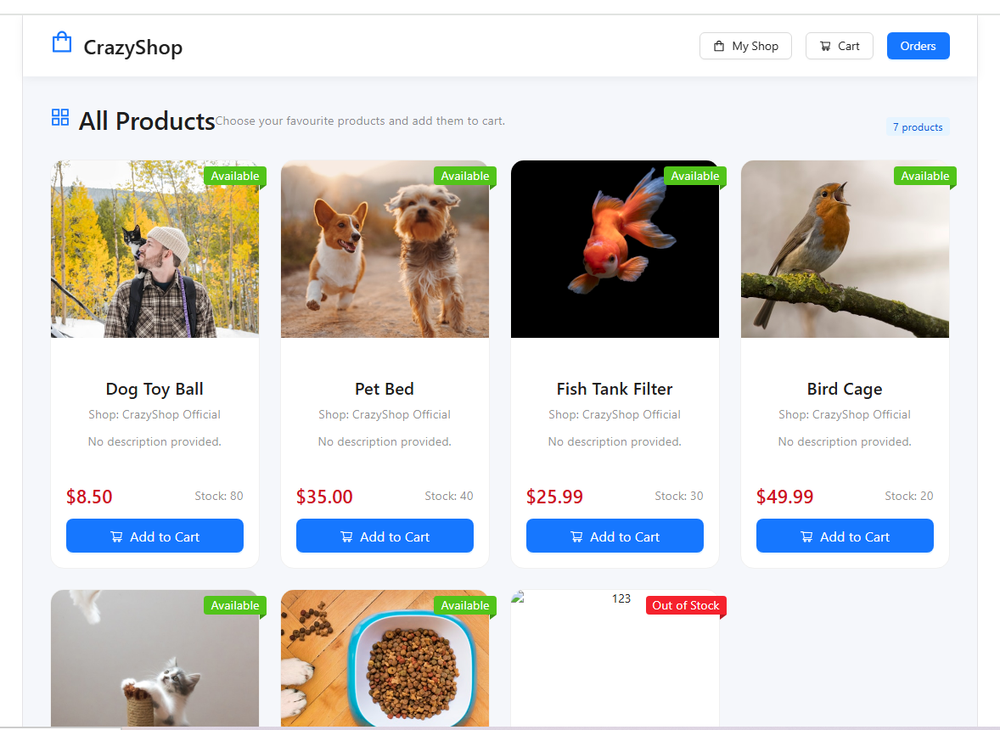
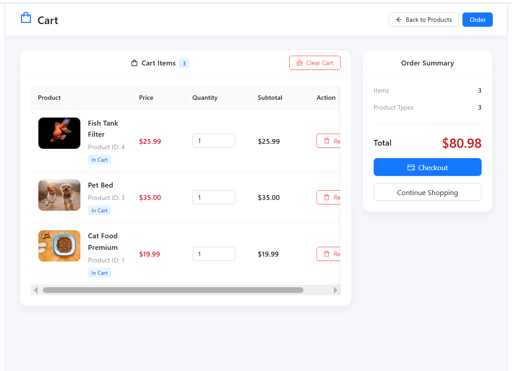
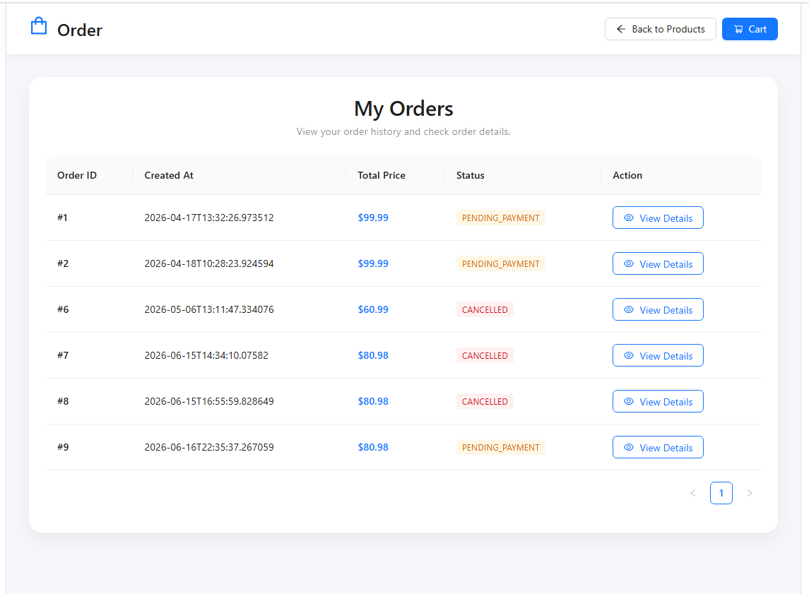
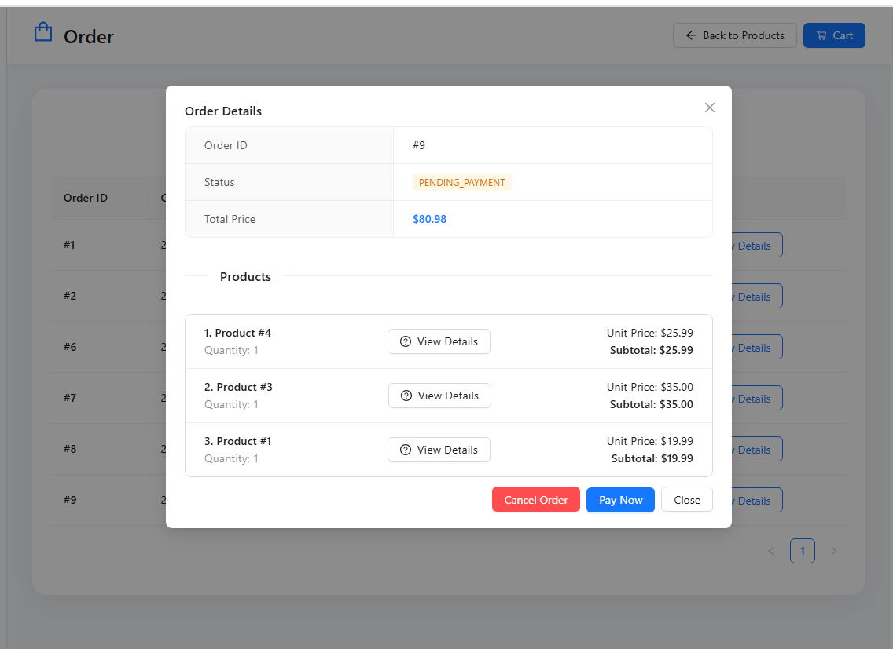
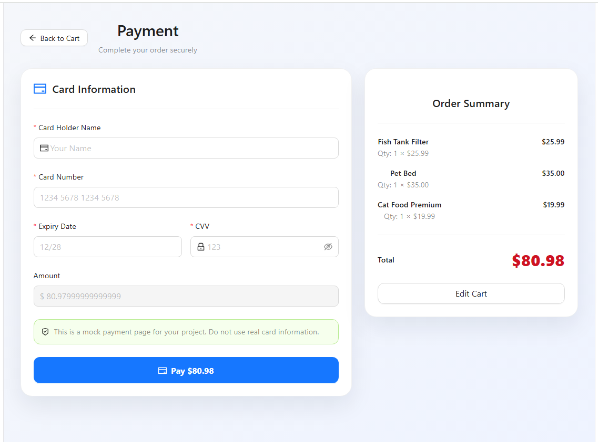
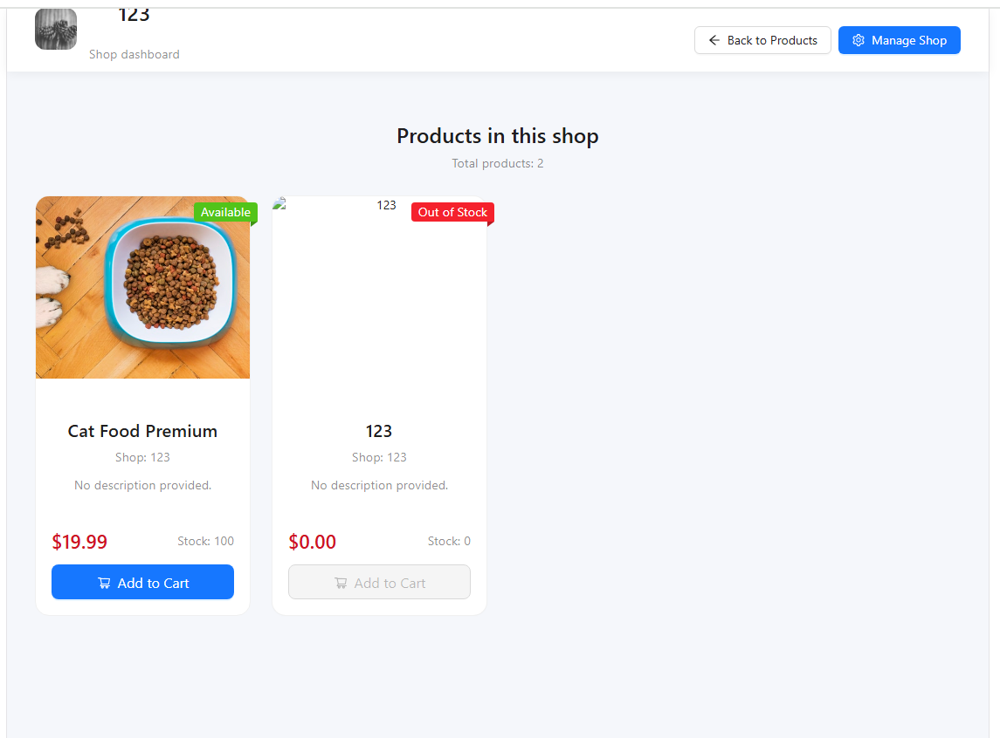
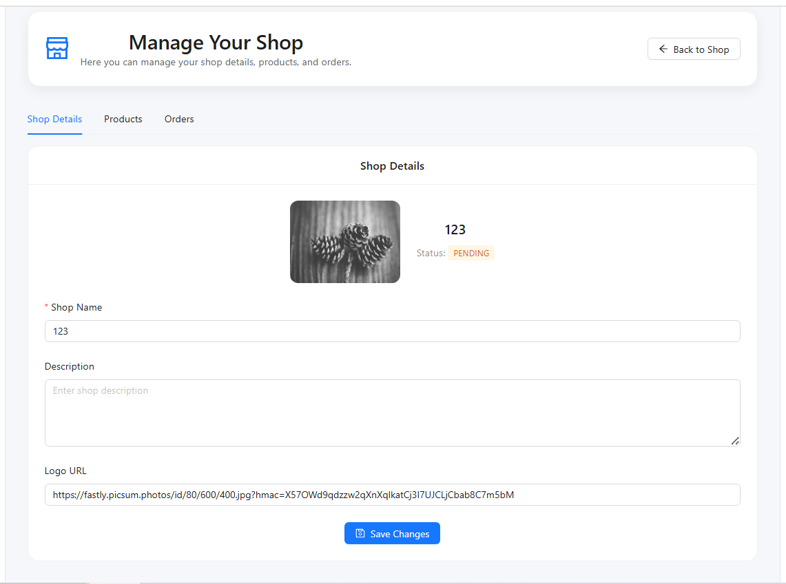
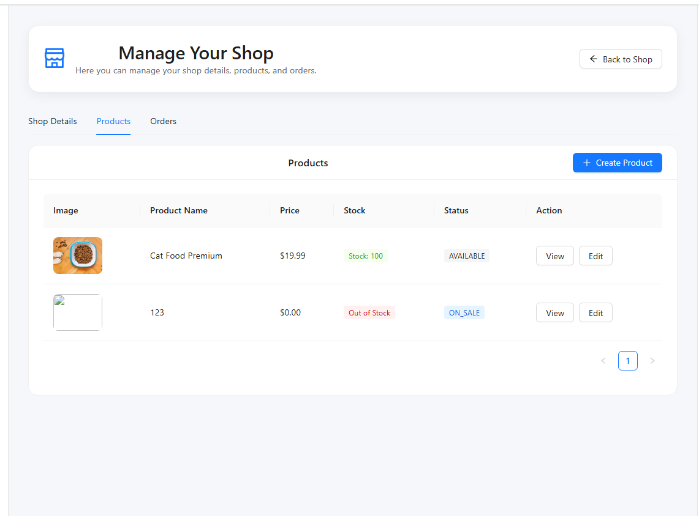
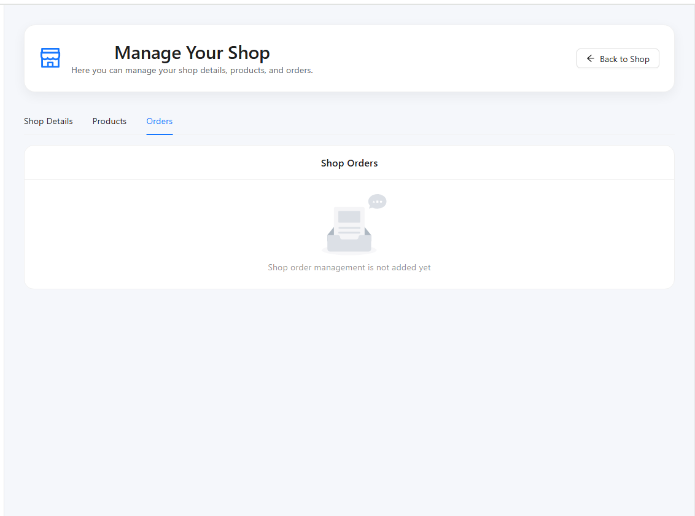

# Run
### npm install
### npm run dev
### This is a simple unfinished project that demonstrates the basic process of building microservices.
### There are still many bugs 🤣🤣🤣
### PRs are welcome
If you find any bugs or have ideas for improvements, feel free to open an issue or submit a pull request.
# Screen shot

